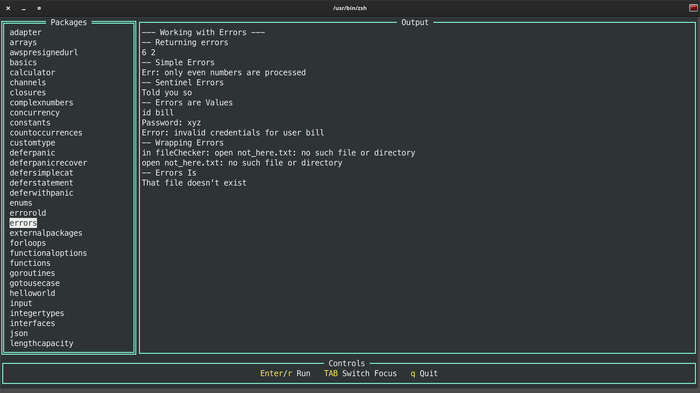

# Learning Go

Starting date with Go: May 15, 2020

I probably started earlier with Go, but it was on that date that I built something professional with Go.

## TUI application



## Books

1. The Go Programming Language
2. Learning Go Second Edition
3. The Power of Go Tools
4. Concurrency in Go
5. Distributed Services with Go
6. Network Programming with Go
7. Go for DevOps
8. 100 Go Mistakes 
9. Building Distributed Applications in Gin 
10. Build Systems with Go 
11. Mastering Go Fourth Edition 
12. Let's Go ✳️
13. Let's Go Further ✳️
14. Microservices with Go 
15. Building Modern CLI Applications with Go 
16. Go for DevOps 
17. gRPC Go for Professionals
18. Event-Driven Architecture in Golang 
19. Domain-Driven Design with Golang 
20. gRPC Microservices in Go 
21. Go Programming Cookbook 
22. Go Programming From Beginner to Professional 
23. Programming Backend with Go 
24. For the love of Go 
25. The Power of Go Tools 
26. Data Structures & Algorithms 
27. gRPC Microservices in Go 
28. Learn Concurrency Programming with Go ✴️
29. Backend Software Architecture with Golang 
30. Kubernetes Programming with Go 
31. Mastering Go CLI and TUI 
32. Web development with Go

## How to work with custom packages

- Create a project and store it in GitHub (https://github.com/thegodeveloper/logging)
- Execute `go get github.com/thegodeveloper/logging`
- Call it from `main.go`

## Install goimports

Enhanced version of `go fmt` called `goimports`.

```shell
go install golang.org/x/tools/cmd/goimports@latest
```

To run it across a project:

```shell
goimports -l -w .
```

- The `-l` flat tells `goimports` to print the files with incorrect formatting to the console.
- The `-w` flag tells `goimports` to modify the files in-place.
- The `.` specifies the files to be scanned: everything in the current directory and all of its subdirectories.

## go vet

There is another class of errors that developers run into. The code is syntactically valid, but there are mistakes that are not what you meant to do.
This includes things like passing the wrong number of parameters to formatting methods or assigning values to variables that are never used.

Run `go vet` on your project with the command:

```shell
go vet ./...

# github.com/thegodeveloper/learning-go/wTime
wTime/master.go:13:25: 2006-02-01 should be 2006-01-02
```

## Resources

### Go Playground

- [Variables](https://goplay.tools/snippet/qF9L8_3REc7)